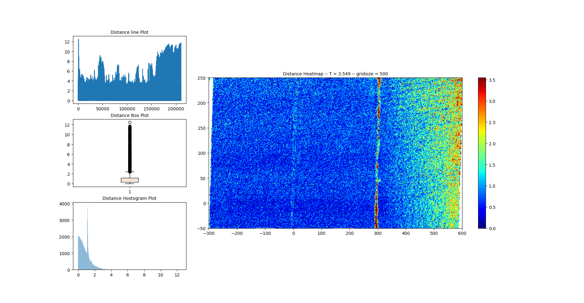

> # ** 3D Scanner**
## Table of Contents
* *Dependencies*
* *Functions*
* *Usage*
* *Example*
* *License*

### **Dependencies**
---
```
Open3D v0.13.0 or later
numpy
matplotlib
```

#### **Functions**
---
- main_image(pcd): This function takes a point cloud object as input and crops it based on its bounding box. It then visualizes the cropped point cloud using Open3D.
- crop_img(pcd): This function takes a point cloud object as input and crops it based on predefined values for x, y, and z dimensions. It then returns the cropped point cloud object.
- compare(pcd1, pcd2, visual = False): This function takes two point cloud objects as input and crops them based on predefined values for x, y, and z dimensions. It then changes the color of each point cloud and visualizes them side by side using Open3D. The visual argument can be set to True to display the visualization.
- compare_2(pc_1,pc_2): This function takes two point cloud objects as input and removes non-finite points, duplicates, and normalizes the normals of the point clouds. It then computes the distances of each point in pc_1 to the closest point in pc_2 and plots the distances using a line plot, a box plot, a histogram, and a Heatmap.

#### **Usage**
---
1. Import Open3D, numpy, and matplotlib
  ```
 import open3d as o3d
 import numpy as np
 import matplotlib.pyplot as plt
 from matplotlib import cm
 from matplotlib.gridspec import GridSpec 
  ```
2. Import the functions from the file
  ```
 from point_cloud_processing import main_image, crop_img, compare, compare_2
  ```
3. Load a point cloud object using Open3D and pass it to one of the functions
  ```
    pcd = o3d.io.read_point_cloud("point_cloud.pcd")
    main_image(pcd)
  ```

#### **Example**
---
In this test we have applied some image processing techniques to analyze 3D models. Using the ROI and defined a transformer matrix to crop the 3D model and computing the point cloud distance can help identify any deformations or anomalies in the model. Additionally, using the box plot to set a threshold and filter out outliers can help improve the accuracy of the analysis. Finally, the heatmap can help visualize and identify the areas of high deformation in the model. Overall, this approach can help provide valuable insights into the quality and integrity of 3D models.



#### License
---
This code is licensed under the MIT License.

